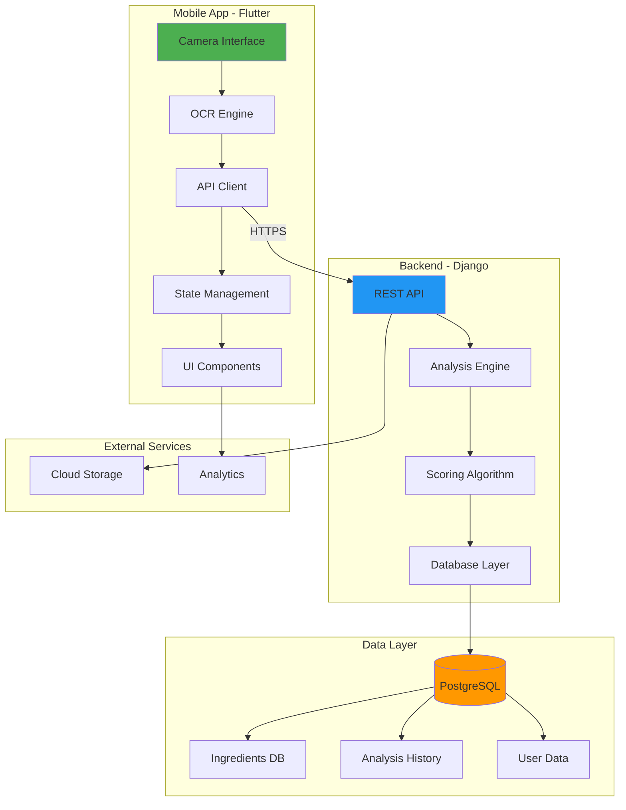

# SafePick - Implementation Plan

## Product Ingredient Analysis App

---

## 🎯 Project Vision

Build a mobile application that empowers consumers to make informed purchasing decisions by instantly analyzing product ingredients through camera-based scanning, providing real-time health ratings and ingredient breakdowns.

---

## 🏗️ System Architecture



---

## 💻 Technology Stack

### Frontend (Mobile Application)

#### Core Framework

-   **Flutter 3.16+** - Cross-platform mobile framework
    -   Single codebase for iOS and Android
    -   Native performance
    -   Rich widget library

#### Key Dependencies

```yaml
dependencies:
    # Camera & Image Processing
    camera: ^0.10.5 # Camera access
    google_ml_kit: ^0.16.0 # On-device ML and OCR
    image_picker: ^1.0.4 # Image selection

    # Networking
    http: ^1.1.0 # HTTP client
    dio: ^5.4.0 # Advanced HTTP client with interceptors

    # State Management
    provider: ^6.1.1 # State management solution

    # Local Storage
    shared_preferences: ^2.2.2 # Key-value storage
    sqflite: ^2.3.0 # Local SQLite database

    # UI Enhancement
    cached_network_image: ^3.3.0 # Image caching
    flutter_spinkit: ^5.2.0 # Loading indicators
    animations: ^2.0.11 # Advanced animations

    # Utilities
    intl: ^0.18.1 # Internationalization
    path_provider: ^2.1.1 # File system paths
```

### Backend (API Server)

#### Core Framework

-   **Django 4.2+** - Python web framework
    -   Robust ORM
    -   Built-in admin panel
    -   Security features

#### Key Dependencies

```python
# requirements.txt
Django==4.2.8
djangorestframework==3.14.0        # REST API framework
psycopg2-binary==2.9.9            # PostgreSQL adapter
django-cors-headers==4.3.1        # CORS handling
pillow==10.1.0                    # Image processing
python-decouple==3.8              # Environment variables
gunicorn==21.2.0                  # Production server
whitenoise==6.6.0                 # Static file serving

# Optional but recommended
celery==5.3.4                     # Async task queue
redis==5.0.1                      # Caching and message broker
django-filter==23.5               # Advanced filtering
drf-spectacular==0.27.0           # API documentation
```

### Database

-   **PostgreSQL 14+**
    -   ACID compliance
    -   Full-text search capabilities
    -   JSON field support
    -   Excellent performance for complex queries

### Development Tools

-   **Git** - Version control
-   **Postman** - API testing
-   **pgAdmin** - Database management
-   **VS Code** - Code editor
-   **Android Studio** - Android emulator
-   **Xcode** - iOS simulator (Mac only)

---

## 📋 Development Phases

### Phase 1: Foundation & Planning (Week 1-2)

#### Objectives

-   Finalize requirements and scope
-   Design system architecture
-   Create database schema
-   Design UI/UX wireframes
-   Set up development environment

#### Deliverables

-   [x] System architecture diagram
-   [ ] Database schema design
-   [ ] API endpoint documentation
-   [ ] UI/UX wireframes (Figma)
-   [ ] Development environment setup guide
-   [ ] Project repository structure

#### Tasks

1. **Requirements Analysis**
    - Define core features (MVP)
    - Identify nice-to-have features (future)
    - Research competitor apps (Yuka, Think Dirty)
2. **Technical Design**
    - Design database tables and relationships
    - Define API endpoints and request/response formats
    - Plan authentication strategy
    - Design caching strategy
3. **UI/UX Design**
    - Create user flow diagrams
    - Design wireframes for all screens
    - Define color scheme and typography
    - Create component library

---

### Phase 2: Backend Development (Week 3-5)

#### Objectives

-   Build robust Django backend
-   Create ingredient database
-   Implement scoring algorithm
-   Develop REST API endpoints
-   Write comprehensive tests

#### Deliverables

-   [ ] Working Django application
-   [ ] Ingredient database with 200+ entries
-   [ ] Functional scoring algorithm
-   [ ] REST API with authentication
-   [ ] API documentation
-   [ ] Unit and integration tests

#### Database Schema

##### Ingredient Model

```python
class Ingredient(models.Model):
    # Basic Information
    name = models.CharField(max_length=255, unique=True, db_index=True)
    alternative_names = models.TextField(blank=True)  # JSON or comma-separated

    # Safety Information
    SAFETY_CHOICES = [
        ('EXCELLENT', 'Excellent - Very beneficial'),
        ('GOOD', 'Good - Generally safe'),
        ('MODERATE', 'Moderate - Use with caution'),
        ('POOR', 'Poor - Avoid if possible'),
        ('HARMFUL', 'Harmful - Avoid completely'),
    ]
    safety_rating = models.CharField(max_length=20, choices=SAFETY_CHOICES)
    safety_score = models.IntegerField()  # Range: -10 (worst) to +10 (best)

    # Categorization
    category = models.CharField(max_length=100)  # e.g., Preservative, Sweetener
    subcategory = models.CharField(max_length=100, blank=True)

    # Detailed Information
    description = models.TextField()
    health_impact = models.TextField()
    common_in = models.TextField()  # Common product types
    allergen_info = models.TextField(blank=True)

    # Metadata
    source = models.CharField(max_length=255)  # Data source reference
    created_at = models.DateTimeField(auto_now_add=True)
    updated_at = models.DateTimeField(auto_now=True)
    is_verified = models.BooleanField(default=False)

    class Meta:
        ordering = ['name']
        indexes = [
            models.Index(fields=['name']),
            models.Index(fields=['safety_rating']),
        ]
```

##### Product Analysis Model

```python
class ProductAnalysis(models.Model):
    # Input Data
    raw_text = models.TextField()  # OCR extracted text
    image_url = models.URLField(blank=True, null=True)

    # Analysis Results
    detected_ingredients = models.JSONField()  # List of ingredient names
    matched_ingredients = models.JSONField()  # Matched with DB
    unmatched_ingredients = models.JSONField()  # Not found in DB

    # Scoring
    RATING_CHOICES = [
        ('BEST', 'Best - Highly recommended'),
        ('GOOD', 'Good - Safe choice'),
        ('AVERAGE', 'Average - Acceptable'),
        ('BAD', 'Bad - Not recommended'),
        ('AVOID', 'Avoid - Harmful ingredients'),
    ]
    overall_rating = models.CharField(max_length=20, choices=RATING_CHOICES)
    overall_score = models.DecimalField(max_digits=3, decimal_places=1)  # 0.0 to 10.0

    # Ingredient Breakdown
    good_ingredients = models.JSONField(default=list)
    bad_ingredients = models.JSONField(default=list)
    neutral_ingredients = models.JSONField(default=list)

    # Recommendations
    recommendation_text = models.TextField()
    alternative_suggestions = models.JSONField(default=list, blank=True)

    # Metadata
    analysis_date = models.DateTimeField(auto_now_add=True)
    processing_time = models.FloatField()  # Seconds
    user = models.ForeignKey('User', on_delete=models.SET_NULL, null=True, blank=True)

    class Meta:
        ordering = ['-analysis_date']
```

##### User Model (Optional for MVP)

```python
class User(AbstractUser):
    email = models.EmailField(unique=True)
    premium = models.BooleanField(default=False)
    scan_count = models.IntegerField(default=0)
    daily_scan_limit = models.IntegerField(default=10)
    last_scan_date = models.DateField(null=True, blank=True)
```

#### API Endpoints

##### 1. Analyze Ingredients

```
POST /api/v1/analyze/
Content-Type: application/json

Request:
{
  "text": "Sugar, Water, Vitamin C, Sodium Benzoate, Aspartame",
  "user_id": "optional-user-id"
}

Response:
{
  "analysis_id": 123,
  "score": 4.5,
  "rating": "AVERAGE",
  "total_ingredients": 5,
  "matched_count": 4,
  "unmatched_count": 1,
  "good_ingredients": [
    {
      "name": "Vitamin C",
      "score": 8,
      "category": "Nutrient",
      "impact": "Boosts immunity and skin health"
    }
  ],
  "bad_ingredients": [
    {
      "name": "Aspartame",
      "score": -7,
      "category": "Artificial Sweetener",
      "impact": "Potential neurological effects, avoid if sensitive"
    },
    {
      "name": "Sodium Benzoate",
      "score": -4,
      "category": "Preservative",
      "impact": "May form benzene in acidic conditions"
    }
  ],
  "neutral_ingredients": [
    {
      "name": "Water",
      "score": 0,
      "category": "Base",
      "impact": "Essential for hydration"
    }
  ],
  "unmatched": ["Sugar"],
  "recommendation": "This product contains concerning artificial ingredients. Consider alternatives with natural sweeteners.",
  "processing_time": 0.234
}
```

##### 2. Get Ingredient Details

```
GET /api/v1/ingredients/{name}/

Response:
{
  "name": "Aspartame",
  "alternative_names": ["E951", "NutraSweet"],
  "safety_rating": "HARMFUL",
  "safety_score": -7,
  "category": "Artificial Sweetener",
  "description": "Artificial sweetener 200x sweeter than sugar",
  "health_impact": "May cause headaches, neurological effects in sensitive individuals",
  "common_in": "Diet sodas, sugar-free products",
  "allergen_info": "Avoid if you have phenylketonuria (PKU)"
}
```

##### 3. Search Ingredients

```
GET /api/v1/ingredients/search/?q=vitamin

Response:
{
  "count": 15,
  "results": [
    {
      "name": "Vitamin C",
      "safety_rating": "EXCELLENT",
      "safety_score": 8,
      "category": "Nutrient"
    },
    // ... more results
  ]
}
```

##### 4. Get Analysis History (Authenticated)

```
GET /api/v1/history/

Response:
{
  "count": 25,
  "results": [
    {
      "id": 123,
      "date": "2026-01-10T10:30:00Z",
      "score": 7.5,
      "rating": "GOOD",
      "ingredient_count": 8
    },
    // ... more results
  ]
}
```

#### Scoring Algorithm

**Core Logic:**

```python
def calculate_product_score(ingredients_list, ingredient_db):
    """
    Calculate overall product score based on ingredients

    Algorithm:
    1. Start with base score of 10.0
    2. For each ingredient:
       - If beneficial (score > 5): Add small bonus (0.1)
       - If harmful (score < -3): Apply penalty (score * 0.15)
       - If neutral: No change
    3. Apply modifiers:
       - Too many ingredients penalty (>20 ingredients: -0.5)
       - Unknown ingredients penalty (-0.2 per unknown)
    4. Clamp final score between 0 and 10
    5. Determine rating based on score ranges

    Returns: (score, rating, good_list, bad_list, neutral_list)
    """

    base_score = 10.0
    good_ingredients = []
    bad_ingredients = []
    neutral_ingredients = []
    unknown_count = 0

    for ingredient_name in ingredients_list:
        ingredient_name = ingredient_name.strip()

        try:
            # Try exact match first
            ingredient = Ingredient.objects.get(name__iexact=ingredient_name)
        except Ingredient.DoesNotExist:
            # Try alternative names
            ingredient = Ingredient.objects.filter(
                alternative_names__icontains=ingredient_name
            ).first()

            if not ingredient:
                unknown_count += 1
                continue

        # Categorize and score
        if ingredient.safety_score > 5:
            # Beneficial ingredient
            good_ingredients.append({
                'name': ingredient.name,
                'score': ingredient.safety_score,
                'category': ingredient.category,
                'impact': ingredient.health_impact
            })
            base_score += 0.1  # Small bonus

        elif ingredient.safety_score < -3:
            # Harmful ingredient
            bad_ingredients.append({
                'name': ingredient.name,
                'score': ingredient.safety_score,
                'category': ingredient.category,
                'impact': ingredient.health_impact
            })
            # Apply penalty proportional to harm
            base_score += (ingredient.safety_score * 0.15)

        else:
            # Neutral ingredient
            neutral_ingredients.append({
                'name': ingredient.name,
                'score': ingredient.safety_score,
                'category': ingredient.category,
                'impact': ingredient.health_impact
            })

    # Apply modifiers
    if len(ingredients_list) > 20:
        base_score -= 0.5  # Too many ingredients

    base_score -= (unknown_count * 0.2)  # Unknown ingredients penalty

    # Clamp score
    final_score = max(0.0, min(10.0, base_score))

    # Determine rating
    if final_score >= 8.5:
        rating = 'BEST'
    elif final_score >= 7.0:
        rating = 'GOOD'
    elif final_score >= 5.0:
        rating = 'AVERAGE'
    elif final_score >= 3.0:
        rating = 'BAD'
    else:
        rating = 'AVOID'

    return (
        round(final_score, 1),
        rating,
        good_ingredients,
        bad_ingredients,
        neutral_ingredients
    )
```

#### Testing Strategy

**Unit Tests:**

-   Test scoring algorithm with various ingredient combinations
-   Test ingredient matching logic
-   Test API serializers

**Integration Tests:**

-   Test complete analysis workflow
-   Test database queries
-   Test API endpoints

**Test Coverage Goal:** 80%+

---

### Phase 3: Frontend Development (Week 6-8)

#### Objectives

-   Build Flutter mobile application
-   Implement camera and OCR functionality
-   Create beautiful, intuitive UI
-   Connect to backend API
-   Implement state management

#### Deliverables

-   [ ] Functional Flutter app
-   [ ] Camera integration with OCR
-   [ ] All UI screens implemented
-   [ ] API integration complete
-   [ ] Local caching implemented
-   [ ] Error handling and loading states

#### App Structure

```
lib/
├── main.dart                      # App entry point
├── config/
│   ├── app_config.dart           # App configuration
│   ├── theme.dart                # App theme
│   └── routes.dart               # Navigation routes
├── models/
│   ├── ingredient.dart           # Ingredient model
│   ├── analysis_result.dart      # Analysis result model
│   └── user.dart                 # User model
├── services/
│   ├── api_service.dart          # Backend API client
│   ├── camera_service.dart       # Camera handling
│   ├── ocr_service.dart          # Text recognition
│   ├── storage_service.dart      # Local storage
│   └── analytics_service.dart    # Analytics tracking
├── providers/
│   ├── analysis_provider.dart    # Analysis state
│   ├── history_provider.dart     # History state
│   └── user_provider.dart        # User state
├── screens/
│   ├── home/
│   │   └── home_screen.dart
│   ├── camera/
│   │   ├── camera_screen.dart
│   │   └── preview_screen.dart
│   ├── result/
│   │   └── result_screen.dart
│   ├── history/
│   │   └── history_screen.dart
│   ├── ingredient_detail/
│   │   └── ingredient_detail_screen.dart
│   └── settings/
│       └── settings_screen.dart
├── widgets/
│   ├── common/
│   │   ├── loading_indicator.dart
│   │   ├── error_widget.dart
│   │   └── custom_button.dart
│   ├── score_display/
│   │   ├── score_gauge.dart
│   │   └── rating_badge.dart
│   └── ingredient_list/
│       ├── ingredient_card.dart
│       └── ingredient_chip.dart
└── utils/
    ├── constants.dart
    ├── helpers.dart
    └── validators.dart
```

#### Key Screens

##### 1. Home Screen

-   Welcome message
-   Quick scan button
-   Recent scans (history preview)
-   Search ingredients feature
-   Settings access

##### 2. Camera Screen

-   Live camera preview
-   Capture button
-   Flash toggle
-   Gallery picker
-   Guidance overlay (frame for ingredient list)

##### 3. Preview Screen (After Capture)

-   Captured image preview
-   Extracted text display (editable)
-   Confirm/Retake buttons
-   Loading indicator during analysis

##### 4. Result Screen

-   Large score display (X/10)
-   Rating badge (BEST/GOOD/AVERAGE/BAD/AVOID)
-   Color-coded by rating
-   Recommendation text
-   Expandable sections:
    -   ✅ Good Ingredients
    -   ⚠️ Concerning Ingredients
    -   ℹ️ Neutral Ingredients
-   Save to history button
-   Share results button

##### 5. History Screen

-   List of past analyses
-   Filter by rating
-   Search functionality
-   Swipe to delete
-   Tap to view details

##### 6. Ingredient Detail Screen

-   Ingredient name
-   Safety rating and score
-   Category
-   Detailed description
-   Health impact
-   Common products
-   Allergen information

#### UI/UX Specifications

**Color Scheme:**

```dart
class AppColors {
  // Rating Colors
  static const Color best = Color(0xFF4CAF50);      // Green
  static const Color good = Color(0xFF8BC34A);      // Light Green
  static const Color average = Color(0xFFFF9800);   // Orange
  static const Color bad = Color(0xFFFF5722);       // Deep Orange
  static const Color avoid = Color(0xFFF44336);     // Red

  // UI Colors
  static const Color primary = Color(0xFF2196F3);   // Blue
  static const Color secondary = Color(0xFF03A9F4); // Light Blue
  static const Color background = Color(0xFFF5F5F5);
  static const Color surface = Colors.white;
  static const Color error = Color(0xFFB00020);
}
```

**Typography:**

```dart
class AppTextStyles {
  static const TextStyle headline1 = TextStyle(
    fontSize: 32,
    fontWeight: FontWeight.bold,
    color: Colors.black87,
  );

  static const TextStyle score = TextStyle(
    fontSize: 64,
    fontWeight: FontWeight.bold,
  );

  static const TextStyle body = TextStyle(
    fontSize: 16,
    color: Colors.black87,
  );
}
```

**Animations:**

-   Score counter animation (count up effect)
-   Smooth page transitions
-   Card expand/collapse animations
-   Loading shimmer effects

---

### Phase 4: Integration & Testing (Week 9-10)

#### Objectives

-   End-to-end testing
-   Performance optimization
-   Bug fixes
-   User acceptance testing
-   Documentation

#### Testing Checklist

**Functional Testing:**

-   [ ] Camera captures images correctly
-   [ ] OCR extracts text accurately (>90%)
-   [ ] API communication works
-   [ ] Scoring algorithm produces correct results
-   [ ] All screens navigate properly
-   [ ] History saves and loads correctly
-   [ ] Error handling works for all edge cases

**Performance Testing:**

-   [ ] App launches in <3 seconds
-   [ ] Camera opens in <1 second
-   [ ] OCR processes in <2 seconds
-   [ ] API response in <2 seconds
-   [ ] Smooth animations (60 FPS)
-   [ ] Memory usage <150MB

**Compatibility Testing:**

-   [ ] Android 8.0+ devices
-   [ ] iOS 12.0+ devices
-   [ ] Various screen sizes
-   [ ] Different camera qualities
-   [ ] Low network conditions

**User Acceptance Testing:**

-   [ ] 10+ beta testers
-   [ ] Collect feedback
-   [ ] Measure satisfaction
-   [ ] Identify pain points

---

### Phase 5: Deployment & Launch (Week 11-12)

#### Objectives

-   Deploy backend to production
-   Submit app to app stores
-   Create marketing materials
-   Soft launch
-   Monitor and iterate

#### Backend Deployment

**Platform:** Railway / Render / DigitalOcean

**Steps:**

1. Set up production database (PostgreSQL)
2. Configure environment variables
3. Set up static file serving
4. Configure CORS for mobile app
5. Set up SSL certificate
6. Deploy Django application
7. Run migrations
8. Import ingredient database
9. Test all endpoints
10. Set up monitoring (Sentry)

**Environment Variables:**

```
DEBUG=False
SECRET_KEY=your-secret-key
DATABASE_URL=postgresql://...
ALLOWED_HOSTS=yourdomain.com
CORS_ALLOWED_ORIGINS=*
```

#### Mobile App Deployment

**Android (Google Play Store):**

1. Create developer account ($25 one-time)
2. Build release APK/AAB
3. Create store listing
4. Add screenshots and description
5. Set up pricing (free with in-app purchases)
6. Submit for review
7. Wait for approval (1-3 days)

**iOS (Apple App Store):**

1. Create developer account ($99/year)
2. Build release IPA
3. Create app in App Store Connect
4. Add screenshots and description
5. Submit for review
6. Wait for approval (1-7 days)

#### Marketing Materials

-   App icon (1024x1024)
-   Screenshots (5-8 per platform)
-   App description (compelling copy)
-   Privacy policy
-   Terms of service
-   Landing page (optional)

---

## 💰 Revenue Strategy

### Tier 1: Freemium Model (Launch)

**Free Tier:**

-   10 scans per day
-   Basic ingredient analysis
-   Score and rating
-   Limited history (last 7 days)

**Premium Tier ($4.99/month or $39.99/year):**

-   Unlimited scans
-   Full history
-   Allergen alerts
-   Product alternatives
-   Export reports (PDF)
-   Ad-free experience
-   Priority support

**Expected Conversion:** 5-10%

### Tier 2: In-App Purchases (Month 3+)

-   **Allergen Profile:** $1.99 (one-time)
-   **Advanced Reports:** $0.99 per report
-   **Ingredient Encyclopedia:** $2.99 (one-time)

### Tier 3: Affiliate Marketing (Month 6+)

-   Partner with Amazon, iHerb, Thrive Market
-   Recommend healthier alternatives
-   Earn 5-10% commission
-   **Projected:** $500-2000/month at 10K users

### Tier 4: B2B Partnerships (Year 1+)

-   Health food stores
-   Organic brands
-   Fitness centers
-   **Pricing:** $500-2000/month per partner

### Tier 5: White-Label Licensing (Year 2+)

-   License technology to retailers
-   Custom branding
-   **Pricing:** $10,000-50,000/year

### Tier 6: Data Insights (Year 2+)

-   Anonymized consumer trends
-   Ingredient popularity reports
-   **Pricing:** $5,000-20,000 per report

---

## 📊 Success Metrics

### Technical KPIs

-   **OCR Accuracy:** >90%
-   **API Response Time:** <2 seconds
-   **App Crash Rate:** <1%
-   **App Load Time:** <3 seconds
-   **User Retention (Day 7):** >40%
-   **User Retention (Day 30):** >20%

### Business KPIs

-   **Month 1:** 1,000 downloads
-   **Month 3:** 5,000 active users
-   **Month 6:** 20,000 active users
-   **Premium Conversion:** 5-10%
-   **App Store Rating:** 4.0+ stars
-   **Daily Active Users:** 30% of total users

### User Engagement

-   **Average Scans/User/Week:** 3-5
-   **Session Duration:** 2-3 minutes
-   **Feature Usage:**
    -   Camera scan: 80%
    -   History: 40%
    -   Ingredient search: 20%

---

## ⚠️ Risk Mitigation

### Technical Risks

**Risk:** OCR accuracy issues

-   **Mitigation:** Allow manual text editing, use high-quality OCR library, provide clear capture guidelines

**Risk:** Slow API response

-   **Mitigation:** Implement caching, optimize database queries, use CDN

**Risk:** Database incomplete

-   **Mitigation:** Start with common ingredients, allow user submissions, continuous updates

### Business Risks

**Risk:** Low user adoption

-   **Mitigation:** Strong marketing, influencer partnerships, app store optimization

**Risk:** Competition

-   **Mitigation:** Unique features, better UX, focus on specific niches (e.g., baby products)

**Risk:** Legal issues (health claims)

-   **Mitigation:** Clear disclaimers, consult legal counsel, cite sources

---

## 🚀 Post-Launch Roadmap

### Version 1.1 (Month 2-3)

-   [ ] Barcode scanning
-   [ ] Product database
-   [ ] User accounts
-   [ ] Cloud sync

### Version 1.2 (Month 4-6)

-   [ ] Allergen profiles
-   [ ] Product alternatives
-   [ ] Social sharing
-   [ ] Multi-language support

### Version 2.0 (Month 7-12)

-   [ ] AI-powered recommendations
-   [ ] Personalized health goals
-   [ ] Community features
-   [ ] Integration with fitness apps

---

## 📚 Resources & References

### Learning Resources

-   **Flutter:** [flutter.dev/docs](https://flutter.dev/docs)
-   **Django REST:** [django-rest-framework.org](https://www.django-rest-framework.org/)
-   **Google ML Kit:** [developers.google.com/ml-kit](https://developers.google.com/ml-kit)

### Data Sources

-   **Open Food Facts:** [world.openfoodfacts.org](https://world.openfoodfacts.org/)
-   **EWG Database:** [ewg.org](https://www.ewg.org/)
-   **FDA GRAS List:** [fda.gov](https://www.fda.gov/)

### Community

-   **Flutter Discord:** [discord.gg/flutter](https://discord.gg/flutter)
-   **Django Forum:** [forum.djangoproject.com](https://forum.djangoproject.com/)
-   **Stack Overflow:** Tag questions with `flutter`, `django`, `ocr`

---

## ✅ Next Steps

1. **Review this plan** with your team
2. **Set up development environment** (Python, Flutter, PostgreSQL)
3. **Create GitHub repository** and initialize projects
4. **Start with Phase 1** - complete planning and design
5. **Build ingredient database** - this is critical for MVP
6. **Develop backend first** - API must be solid
7. **Build Flutter UI** - connect to backend
8. **Test extensively** - quality is crucial
9. **Deploy and launch** - start small, iterate fast

---

## 💡 Final Thoughts

**This app has strong potential because:**

-   ✅ Solves a real problem
-   ✅ Growing market (health-conscious consumers)
-   ✅ Simple, clear value proposition
-   ✅ Multiple revenue streams
-   ✅ Scalable technology stack

**Keys to success:**

1. **Start small** - MVP with core features
2. **Focus on accuracy** - ingredient database quality is critical
3. **Great UX** - make it dead simple to use
4. **Build community** - engage users, gather feedback
5. **Iterate fast** - release updates based on user needs

**You've got this! 🚀**
